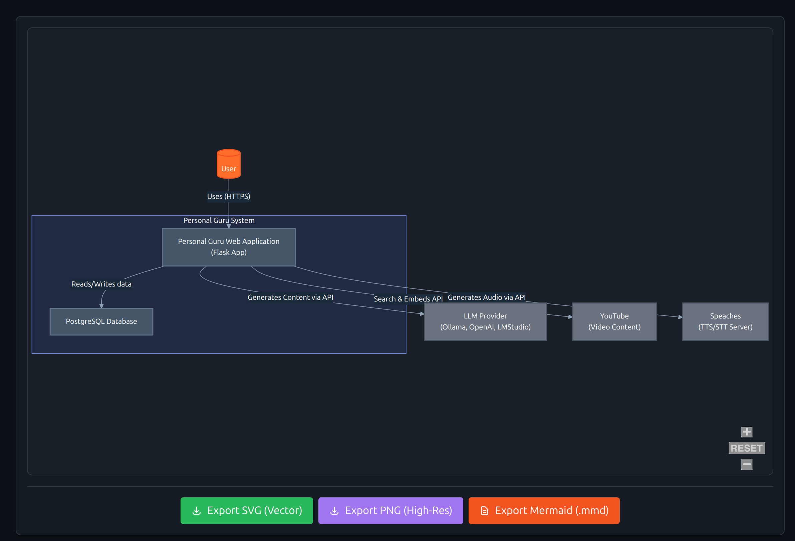

# Simple GitDiagram

Turn any GitHub repository into an interactive diagram for visualization in seconds.



**This is a simplified, lightweight version of GitDiagram built with Flask and SQLite.** It is designed for ease of use, local development, and modularity.

> This is a simplified, lightweight version of [GitDiagram](https://github.com/ahmedkhaleel2004/gitdiagram) built with Flask and SQLite.
> The diagram generation may fail for large repositories.

## 🚀 Features

- **Lightweight Stack**: Pure Python (Flask) backend with no Docker or complex orchestration required.
- **In-Code Database**: Uses SQLite for simple, file-based caching.
- **Private & Public Repos**: Full support for diagramming private repositories using your GitHub Personal Access Token (PAT).
- **Local LLM Support**: Configured to work with local OpenAI-compatible LLM endpoints (e.g., LM Studio, Ollama).
- **Interactive Diagrams**:
  - Generates Mermaid.js flowcharts to visualize codebase architecture
  - **Zoom & Pan**: Navigate large diagrams with mouse controls
  - **Clickable Nodes**: Click on any node to open the corresponding file on GitHub (opens in new tab)
  - **Multiple Export Formats**: Export as SVG, PNG, or Mermaid (.mmd) for use in other tools ( Arrange > Insert > Mermaid)

## ⚙️ Tech Stack

- **Backend**: Flask (Python)
- **Database**: SQLite (via Flask-SQLAlchemy)
- **Frontend**: Vanilla HTML/JavaScript + Tailwind CSS
- **AI**: Configurable OpenAI-compatible provider

## 🛠️ How to Run

1. **Clone the repository**:

2. **Create a virtual environment and install dependencies**:

    ```bash
    python3 -m venv venv
    source venv/bin/activate  # On Windows: venv\Scripts\activate
    pip install -r requirements.txt
    ```

3. **Configure Environment**:

    Copy the example environment file:

    ```bash
    cp .env.example .env
    ```

    Edit `.env` with your settings:
    - `GITHUB_PAT`: Your GitHub Personal Access Token (for higher rate limits and private repos).
    - `LLM_BASE_URL`: URL of your local LLM (e.g., `http://192.168.1.51:1234/v1`).
    - `LLM_MODEL_NAME`: Name of the model to use.
    - `LLM_API_KEY` : Your LLM API Key.

4. **Start the Application**:

    ```bash
    python simple_git_diagram/run.py
    ```

    The app will be accessible at [http://localhost:5000](http://localhost:5000).

## 🔒 Private Repositories

To generate a diagram for a private repository:

1. Ensure your `GITHUB_PAT` in `.env` is valid OR enter it manually in the UI.
2. Enter the full repository URL (e.g., `https://github.com/username/private-repo`).
3. Click **Generate Diagram**.

## 📥 Export Options

Once your diagram is generated, you can export it in multiple formats:

- **SVG**: Vector graphics format, perfect for scalability
- **PNG**: Raster image format for quick sharing
- **Mermaid (.mmd)**: Plain text Mermaid code for importing into other tools

### Importing into Draw.io

To import your diagram into Draw.io (diagrams.net):

1. Click **Export Mermaid (.mmd)** to download the diagram code
2. Open [Draw.io](https://app.diagrams.net)
3. Navigate to **Arrange > Insert > Advanced > Mermaid**
4. Paste the content from the `.mmd` file
5. Draw.io will render it as an editable diagram

This preserves all colors, links, and styling from the original diagram!

## 📂 Project Structure

```text
simple_git_diagram/
├── app/
│   ├── __init__.py          # App factory and DB setup
│   ├── models.py            # SQLite database models
│   ├── routes.py            # Main application logic
│   ├── services/            # Business logic
│   │   ├── github_service.py # GitHub API interactions
│   │   └── llm_service.py    # LLM generation interactions
│   └── templates/           # HTML templates
├── run.py                   # Entry point
requirements.txt             # Python dependencies
```

## License

MIT License
